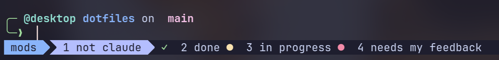

# tmux-status

A [Claude Code](https://claude.com/claude-code) mod that shows what each
Claude session is doing in your tmux status bar, so you can see at a glance
which windows are busy, which need you and which have finished.



| Glyph | State | Shown |
| --- | --- | --- |
|  yellow | working on a turn | always |
|  red | waiting for you: a permission prompt, a question, an MCP elicitation | always |
|  green | finished its turn | only on windows you are not looking at |

Outside tmux the mod does nothing.

## Install

**1. The mod.** From GitHub:

```sh
claude plugin marketplace add XavierYounan/tmux_mod
claude plugin install tmux-status@tmux-status
```

Or from a local clone, for one session: `claude --plugin-dir /path/to/tmux_mod`.

**2. The tmux side.** Add this to `tmux.conf`, *after* your theme or plugin
manager loads (themes usually overwrite the window formats):

```tmux
source-file /path/to/tmux_mod/tmux/claude-status.tmux
```

That prefixes the glyph to every window tab. To put it somewhere else, comment
out the two `if -F` lines at the bottom of that file and drop
`#{E:@claude_status}` into your own format. Colours are the `@claude_icon_*`
options, so you can override them after sourcing.

## How it works

The mod hooks Claude Code's turn, permission and tool events and runs
`tmux set-option -w -t $TMUX_PANE @claude_state <state>`. Everything visual
lives in tmux formats, so it works with any theme. The `done` state stays
until your next prompt, but the format only shows it on inactive windows.

One state per window: if you run two Claude sessions in split panes of the
same window, the last one to change wins.

## Compatibility

Mods (Claude Code's function-hooks plugins) are early access, and their API
can change between releases. Built and tested against Claude Code 2.1.289;
if it stops working after an update, please open an issue.

## Develop

```sh
claude plugin validate .
claude plugin test .
```
